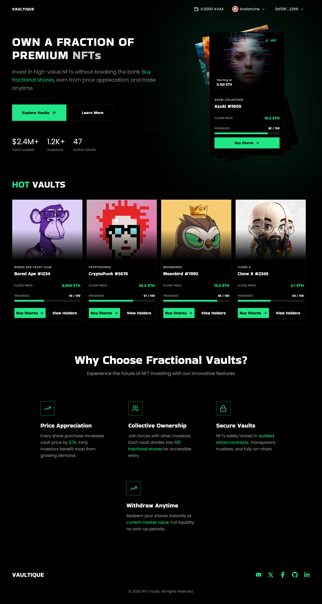
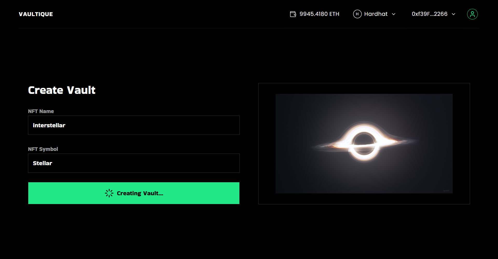
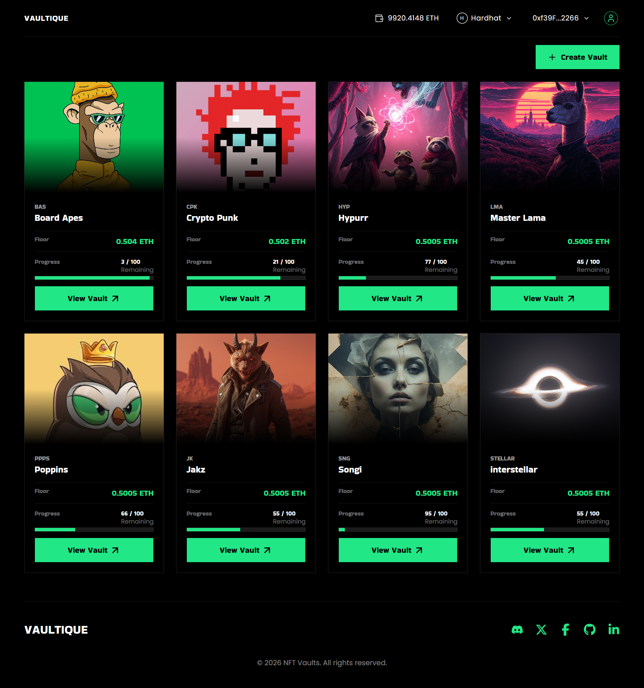
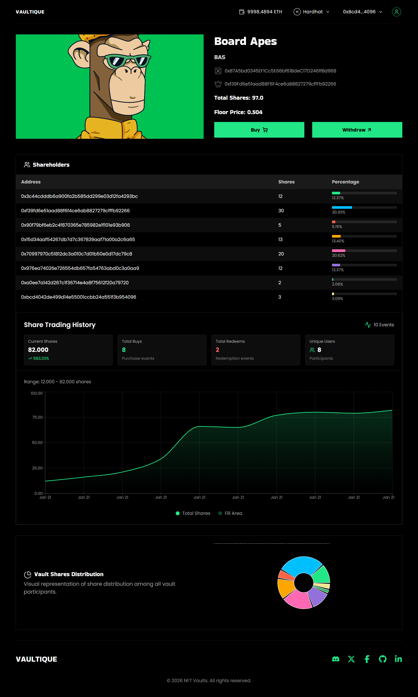
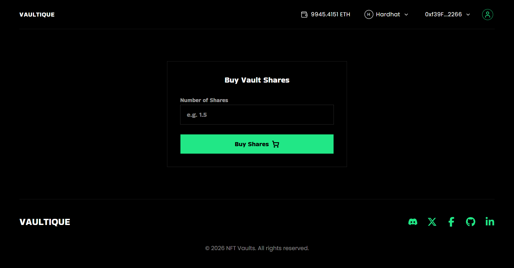
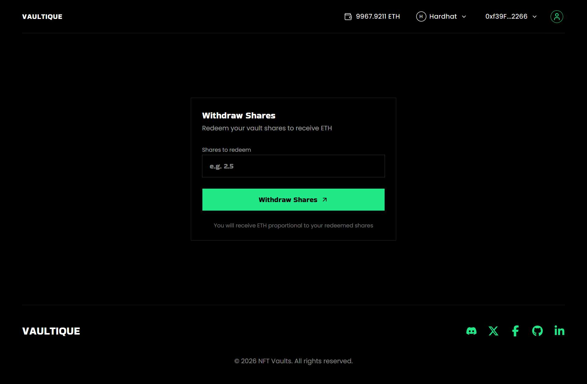
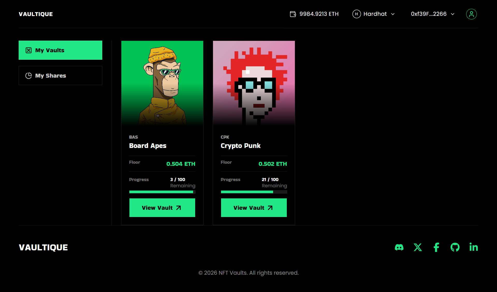
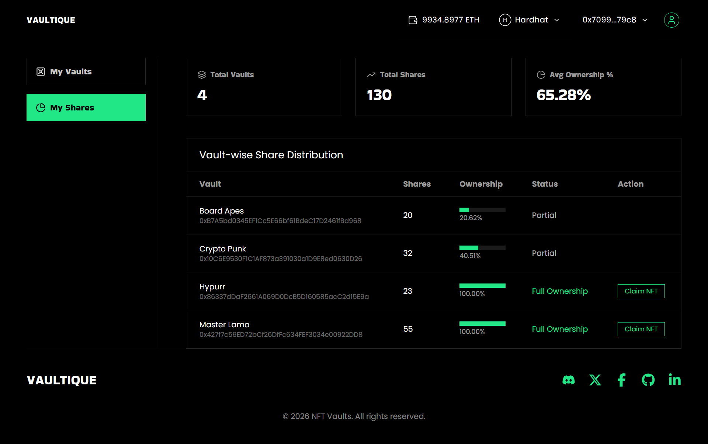
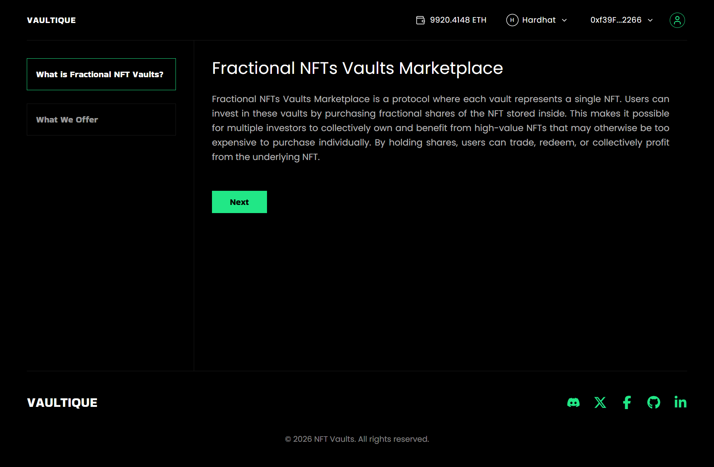
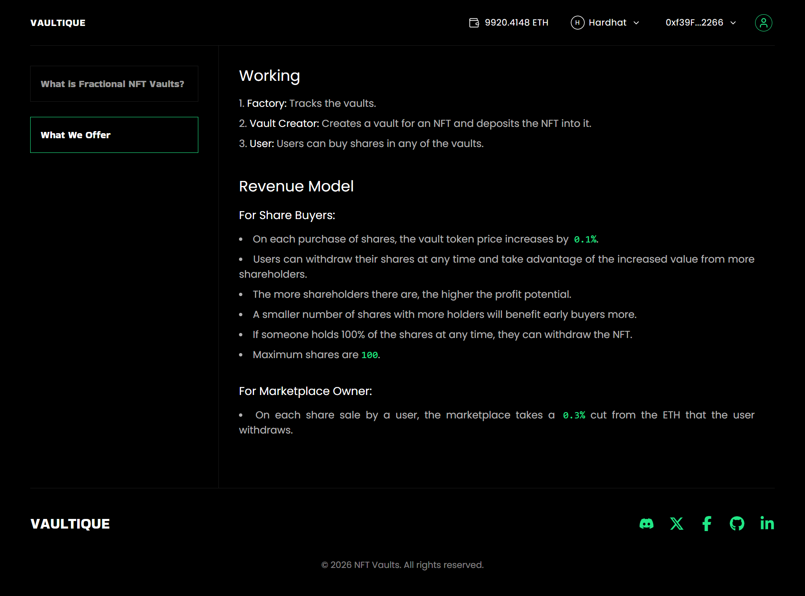

# Fractional NFTs Vaults Marketplace


**Description:**
Fractional NFTs Vaults Marketplace is a protocol where each vault represents a single NFT. Users invest in these vaults by purchasing fractional shares of the NFT stored inside. This makes it possible for multiple investors to collectively own and benefit from high-value NFTs that may otherwise be too expensive to purchase individually. By holding shares, users can trade, redeem, or collectively profit from the underlying NFT.

---

## Features

### 1) Hero Section


_Landing page for the DApp._

---

### 2) Create Vault


_Allow user to create a vault (pool)._

---

### 3) Explore All Vaults


_Explore all created vaults._

---

### 4) Single Vaults


_Single vault which has the full chart, graph of shares redeems, list of members against the vault and how many shares they hold._

---

### 5) Buy Share



---

### 6) Withdraw Share



---

### 7) User Dashboard

#### User vaults



#### User Shares Across other vaults



---

### 8) Explore More

#### What is Fractional Vaults



#### What we offer



---

## Revenue Model

1. **For Share Buyers:**

   - On each purchase of shares, the vault token price increases by `0.1%`.
   - Users can withdraw their shares at any time and take advantage of the increased value from more shareholders.
   - The more shareholders there are, the higher the profit potential.
   - A smaller number of shares with more holders will benefit early buyers more.
   - If someone holds 100% of the shares at any time, they can withdraw the NFT.
   - Maximum shares are `100`.

2. **For Marketplace Owner:**

   - On each share sale by a user, the marketplace takes a `0.3%` cut from the ETH that the user withdraws.

---

## Developed With

- React.js
- Tailwind CSS
- Express.js and Node.js
- MongoDB
- Reown AppKit for multi-wallet connection
- Pinata for IPFS NFT art storage
- Ethers.js for blockchain interaction
- Hardhat for smart contract deployment
- Foundry for smart contract testing

---

## Supported Chains

- Sepolia
- Arbitrum Sepolia
- Avalanche Fuji
- Optimism
- Optimism Sepolia
- zkSync
- BSC testnet

---

## On-Chain Addresses

```json
{
  "31337": {
    "FactoryAddress": "0x5FbDB2315678afecb367f032d93F642f64180aa3"
  },
  "43113": {
    "FactoryAddress": "0x54ce66E182eeB380760FFf5A80f14AF7B71ae604"
  },
  "80002": {
    "FactoryAddress": "0xB0735C4Dd83B5853bCee7510E70c34a4a44ccc5e"
  },
  "421614": {
    "FactoryAddress": "0xF414961825013212F6F9583D1Da050C808C58244"
  }
}
```

> Full addresses are included in the repository JSON (/frontend/onchain-protocol/deployment) for each supported chain.

---

## Installation & Usage

```bash
# Clone the repository
git clone https://github.com/AhmadFarazWeb3Developer/Fractional-NFTs-Vaults-Marketplace.git


# Frontend setup
cd frontend
npm install
npm run dev

# Backend setup
cd ../backend
npm install
nodemon

# Open your browser at
http://localhost:5173
```

---

## Smart Contract Details

### Scope

`/onchain-protcol/src`

- `/Factory.sol`
- `/FractionalNFT.sol`
- `/FractionalNFTVault.sol`
- `/VaultToken.sol`

### Testing

- Foundry

### Deployment

- Hardhat

### Audit

- Manual audit with proper CEI, ownership, and reentrancy checks.
- Automatic tool: Slither

---
